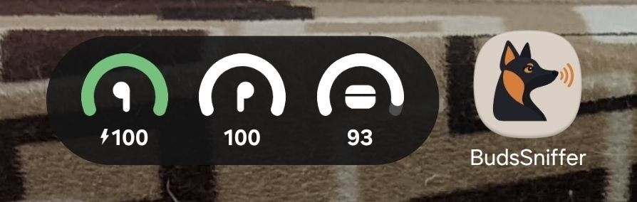

<p align="center">
    
    <h1 align="center"><b>BudsSniffer</b></h1>
    <p align="center">
        Battery levels (left / right / case) for <b>Redmi Buds clones built on JieLi chips</b> — in the app, on a home screen widget and in a notification.
    </p>
</p>
<br/>

## Overview



Such earbuds look like Xiaomi ones and even send Xiaomi-style advertisements, but inside they are generic JieLi hardware. They don't work properly with official Xiaomi apps or the Xiaomi system integration, and on other phones you only get whatever the standard Bluetooth battery level reports, if anything. BudsSniffer bypasses all that and talks JieLi's own RCSP protocol to the earbuds directly to get per-bud and case charge.

## Features

- Left, right and case battery with charging indicators
- Home screen widget (Jetpack Glance), styled after One UI
- Low battery notification at ≤20% per bud (not the case), re-armed when charging or back above 25%
- Starts automatically when the earbuds connect, via Companion Device Manager — the foreground service runs only while they are connected
- Debug "Probe" screen: BLE scan, manual connect / auth / raw RCSP packets, copyable log

## Supported devices

The primary target is Xiaomi-branded earbuds that are actually JieLi inside. A quick way to tell: SDP Device ID VID `0x05D6` (Zhuhai Jieli Technology) and a GATT service `AE00`.

Tested only with the author's pair sold as Redmi Buds 4 (VID `0x05D6`, PID `0x000A`). Other JieLi earbuds that expose `AE00` and send the `0xC2` AdvInfo push may work, but the byte layout is not guaranteed. Genuine Xiaomi earbuds on non-JieLi chips are not supported.

Requires Android 13+ (`minSdk 33`). Developed on a Samsung Galaxy S24 FE (One UI).

## How it works

The earbuds run JieLi's RCSP protocol over a BLE GATT service:

1. The user picks the earbuds from the list of paired devices; the app creates a Companion Device association.
2. When the earbuds connect over Classic Bluetooth, `BudsCompanionService` is woken by the system and starts a foreground service.
3. The service opens an LE GATT connection to the same address (LE and EDR addresses match on these buds) and uses service `AE00` (`AE01` write, `AE02` notify).
4. It performs the JieLi authentication handshake (6 raw packets, custom block cipher).
5. After authentication the earbuds push an `AdvInfo` packet (opcode `0xC2`) roughly every 0.5 s with L / R / case percentages; bit 7 of each byte is the charging flag.

The protocol was figured out by decompiling Xiaomi's `BluetoothExtension.apk` and cross-checking with open-source JieLi research. Full notes: [`docs/REVERSE_NOTES.md`](docs/REVERSE_NOTES.md). They also cover two passive sources not used by the app: Xiaomi Fast Connect BLE advertisements and the `+XIAOMI` HFP AT command.

## Building

Requirements: Android SDK with API 37 (point `sdk.dir` in `buds-sniffer-android/local.properties` or `ANDROID_HOME` at it). Gradle downloads JDK 25 for the daemon automatically.

```sh
cd buds-sniffer-android
./gradlew assembleDebug
./gradlew installDebug   # with a device connected over adb
./gradlew test           # unit tests for framing, AdvInfo parsing and the auth cipher
```

## Usage

1. Pair the earbuds in system Bluetooth settings.
2. Open BudsSniffer, grant Bluetooth and notification permissions.
3. Pick the earbuds from the paired devices list and confirm the association dialog.
4. Add the widget to the home screen if you want.

## Project layout

```
buds-sniffer-android/   Android app (Kotlin, Jetpack Compose, Glance)
  app/src/main/java/io/github/neisvestney/budssniffer/
    ble/                coroutine wrapper over BluetoothGatt
    rcsp/               JieLi RCSP: framing, auth handshake + cipher, AdvInfo parser
    buds/               battery state, low battery notifications
    service/            companion device association, foreground link service
    widget/             home screen widget
    ui/, probe/         main screen and debug probe screen
docs/REVERSE_NOTES.md   reverse engineering notes
research/ble-scan.cs    Windows BLE advertisement scanner (.NET 10 file-based app)
```

`research/ble-scan.cs` dumps Xiaomi Fast Connect advertisements (`0xFD2D` service data / `0x038F` manufacturer data) from a PC:

```sh
dotnet run research/ble-scan.cs [--all] [name-substring|MAC]
```

## Credits

The JieLi auth cipher (`rcsp/JlAuthCipher.kt`) is a port of
[ElectronicCats/jieli-ble-badge-research](https://github.com/ElectronicCats/jieli-ble-badge-research) `auth.py` (MIT),
itself based on [hybridherbst/web-bluetooth-e87](https://github.com/hybridherbst/web-bluetooth-e87) `jl_auth_v3.py` (MIT).

## Disclaimer

Not affiliated with Xiaomi or JieLi. Redmi is a trademark of Xiaomi.

## License

[MIT](LICENSE)
